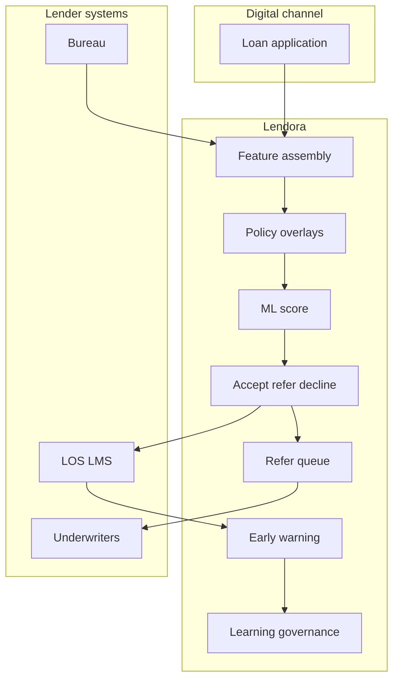

# Lendora

**Source:** `ai-in-financial/ai-in-finance-g-square/`
**Domain:** `ai-fin`
**One-liner:** An automated credit-decisioning service that turns bank/NBFC applicant data into explainable accept/refer/decline outcomes in minutes—with continuous learning bounded by policy, not by silent model drift.
**Wedge:** Digital lending teams at banks and NBFCs launching or scaling online personal/SME credit that still bounce applicants to branch credit officers for routine files.
**Positioning:** Credit decisioning wedge from the G-Square deck’s flagship use case: customers want instantaneous credit; traditional banks cannot staff officer reviews for every online application; ML scores on transactions and profile must learn continuously under credit-policy governance. Distinct from Aegira (fraud ops), Kyvora (reusable KYC identity), and Paritya (LMIC supervisory readiness).

## Market research synthesis

### Thesis from source

Gopi Krishna Suvanam’s “AI & ML Disruption in Finance” positions AI analytics as progressing from describe → predict → prescribe → automatically decide, with learning from responses. Top applications listed: automatic underwriting and early-warning tracking; machine-driven trading; robo-advisory; predictive planning/resource optimisation. Use Case I is explicit: a traditional bank wants online loans with automatic underwriting because customers demand credit in minutes without branch or credit-officer interaction; the solution is ML credit scores from transactions and profile that learn continuously, targeting “online credit in 5 minutes.” Use Case II (FX hedging) and Use Case III (CFO text analytics) confirm the vendor’s broader pattern—but the sharpest productisable workflow is underwriting speed with continuous learning.

The product is therefore a decisioning service: policy-coded outcomes (accept/refer/decline), reason codes, early-warning post-booking monitors, and controlled retraining—not a generic “AI lending platform” brochure.

### Buyer & economic model

- **Primary buyer:** Head of Digital Lending / Chief Credit Officer (as economic veto) at a bank or NBFC.
- **Users:** credit-policy owners, underwriters on refer queues, digital product managers, model risk, collections early-warning analysts.
- **Budget owner / value metric:** lending P&L and credit-risk budget. Value metric is auto-decision rate within risk appetite and time-to-yes for approved digital applications.
- **Competing status quo:** rules engines with crude cut-offs; bureau scores alone; manual officer review for most files; shadow Excel models without production controls.

### Domain constraints

- **Regulatory / trust / safety:** fair lending / non-discrimination; adverse action reasons; model risk; affordability and responsible lending; audit of automated decisions.
- **Data sensitivity:** income, transactions, bureau, and alternative data are highly sensitive.
- **Change-management realities:** credit committees will not abdicate; Lendora must keep policy overlays and refer queues first-class, with learning that cannot silently loosen risk appetite.

## Business requirements

- BR-1: Every application must receive accept, refer, or decline within a published digital SLA (target: minutes for straight-through files).
- BR-2: Declines and refers must carry reason codes suitable for adverse-action and underwriter workstreams.
- BR-3: Credit policy overlays (max DTI, excluded segments, product caps) must be able to veto model scores.
- BR-4: Continuous learning may only retrain inside committee-approved envelopes; material loosening requires dual approval.
- BR-5: Early-warning monitors must flag booked accounts that diverge from expected risk within defined windows.
- BR-6: Feature provenance (bureau, bank transactions, alternative data) must be declared per decision.
- BR-7: Explainability artefacts (top factors) must be available to underwriters and auditors without exposing model IP unnecessarily to customers beyond required reasons.
- BR-8: Refer queues must present the same fact pack the model saw, so officers do not re-collect blindly.
- BR-9: Champion/challenger underwriting models must be supported with stability and vintage metrics before promotion.
- BR-10: Audit export must reproduce decision, policy version, model version, and features for any application ID.
- BR-11: FX-hedging and text-analytics patterns from the source are out of scope for v1—credit decisioning only.
- BR-12: Identity proofing may consume Kyvora-like attestations but Lendora does not become a KYC network.

## User stories

Canonical user stories live in sibling [USER_STORIES.md](USER_STORIES.md).

## System design

### Overview

Lendora receives application and data-feature packs, applies policy overlays and ML scores, returns accept/refer/decline with reasons, opens underwriter tasks on refer, monitors booked accounts for early warning, and governs model learning/promotion under credit-committee envelopes.

### Actors & boundaries

- **Actors:** applicant (via host), digital channel, policy owner, underwriter, model risk, collections EWS.
- **Trust boundary:** bank/NBFC remains lender of record; Lendora is decisioning infrastructure under the lender’s licence and policy.
- **Human-in-the-loop points:** refer underwriting; policy changes; model promotion; override approvals.

### Core capabilities

1. **Application intake and feature assembly**.
2. **Policy overlay engine**.
3. **ML score and decisioning**.
4. **Reason codes and explanations**.
5. **Refer queue for underwriters**.
6. **Early-warning monitoring**.
7. **Challenger and learning governance**.
8. **Decision audit reproduction**.

### Conceptual data

- **Primary entities:** Application, FeaturePack, PolicyPack, ModelVersion, CreditDecision, ReasonCode, ReferTask, Override, EarlyWarningAlert, DecisionAudit.
- **Critical events:** application scored, decided, referred, overridden, booked, EWS raised, model promoted.
- **Retention / audit needs:** decisions and feature packs retained for credit-file statutory periods; learning datasets purpose-limited.

### Integrations (conceptual)

- **Systems of record:** LOS/LMS, core banking, bureau gateways, document vaults.
- **Upstream signals:** transaction aggregates, alternative data (where lawful), KYC attestations.
- **Downstream actions:** offer generation, underwriter desktop, booking, collections EWS.

### High-level architecture

### Success metrics

- **Leading:** straight-through decision rate; median time-to-decision; refer handle time; policy-veto rate.
- **Lagging:** vintage NPL vs appetite; override rate quality; digital origination volume; fair-lending exception rate.

## OpenAPI skeleton

Canonical HTTP surface lives in sibling [openapi.yaml](openapi.yaml). Summary:

- **Base path:** `/v1/...`
- **Auth:** `X-API-Key` for LOS integration; Bearer JWT for credit operators.
- **Resource groups:** Applications, Decisions, Policies, ReferTasks, EarlyWarnings, Models, Audits.
