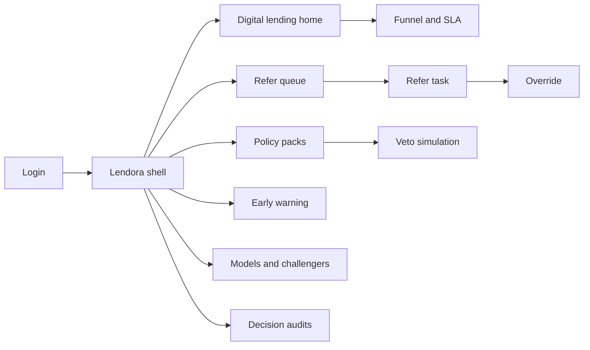
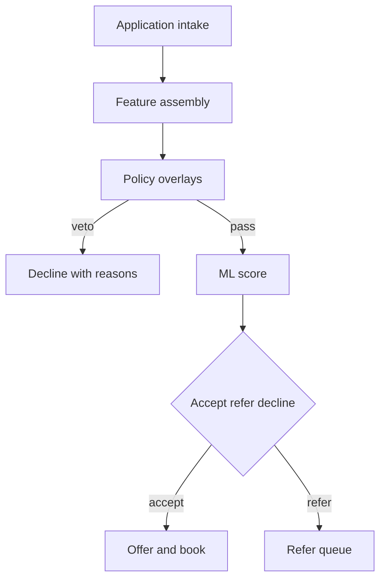
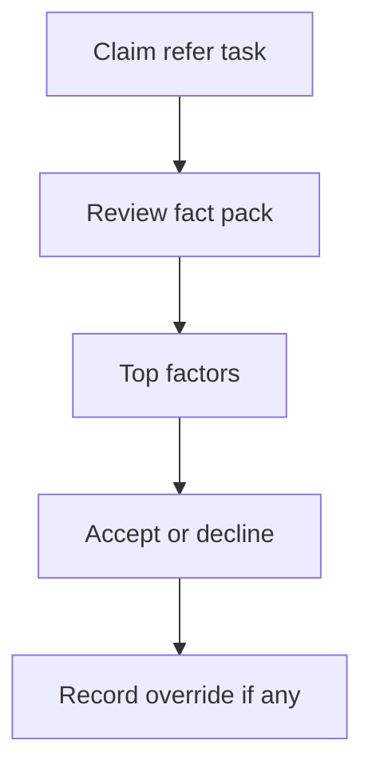

# Lendora — Web app

**Product:** [PRODUCT.md](./PRODUCT.md)
**Primary surface:** Credit-decisioning console (policy overlays + refer underwriting + early-warning under one Lendora shell)
**Secondary surfaces:** Decision audit reproduction viewer (read-only export); applicant-facing reason taxonomy preview (read-only, for product managers)
**Design thesis:** Lendora is a credit committee that runs at API speed—not a “smart lending dashboard.” The metaphor is a underwriting vault: warm stone-grey ground, brass accept seals, slate-blue refer trays, and iron decline stamps. Policy overlays sit above the model like a physical stamp pad the score cannot ignore. Continuous learning is shown as envelopes with locks, never as a silent drift chart. The Lendora wordmark is a brass mint mark on every decision-bearing screen so lenders know whose appetite they are enforcing.

## UX research synthesis

### Category peers (best-in-class)

- **Zest AI / ZAML decisioning:** Explainable factors for underwriters, fair-lending monitoring adjacent to decisions. Steal: top-factor panels for refer work; reject opaque “AI approved” badges without policy version.
- **Upstart / modern LOS decision panes:** Minutes-to-yes funnel metrics and reason taxonomies for declines. Steal: SLA clock for straight-through files; reject consumer marketing chrome in the operator console.
- **nCino / Thought Machine credit workspaces:** Policy packs per product, officer queues with document packs. Steal: refer queue with the same fact pack the model saw (BR-8); reject sprawling core-banking nav.
- **FICO Decision Management Platform:** Rules/policy veto over scores, champion/challenger with vintage stability. Steal: hard policy veto chrome and dual approval for appetite loosening (BR-3, BR-4).

### Patterns to adopt / reject

- **Adopt:** Accept/refer/decline as the primary object; reason codes on every non-accept; policy overlay editor with veto simulation; early-warning by vintage; immutable decision audit by application id; challenger stability before promote.
- **Reject:** Fraud-queue aesthetics (Aegira clone); KYC network identity explorer; purple “AI underwriter” chat as primary path; editable historical decision outcomes; one shared policy default across personal and SME products.

### Trust, density, and workflow constraints from PRODUCT.md

Credit committees will not abdicate (change-management): policy overlays and refer queues are first-class (BR-3, BR-8). Learning cannot silently loosen appetite (BR-4). Declines/refers need adverse-action-suitable reasons (BR-2). Feature provenance declared per decision (BR-6). Audit must reproduce decision + policy + model + features (BR-10). FX hedging and CFO text analytics from the source deck stay out (BR-11).

## Information architecture

### Nav model

### Roles → default home

| Role | Default home | Why |
|------|--------------|-----|
| Head of digital lending | Digital lending home — funnel + SLA | Five-minute promise (BR-1) |
| Chief credit officer | Policy packs | Appetite veto (BR-3) |
| Credit underwriter | Refer queue | Fact-pack decisions (BR-8) |
| Collections EWS analyst | Early warning | Vintage divergence (BR-5) |
| Model risk officer | Models and challengers | Stability before promote (BR-9) |
| Platform admin | Decision audits + access | Separation of policy vs model operators |

### Cross-links to OpenAPI resources

| Nav area | OpenAPI tags / resources |
|----------|---------------------------|
| Applications / funnel | Applications |
| Accept/refer/decline | Decisions |
| Policy overlays | Policies |
| Underwriter work | ReferTasks |
| Overrides | Overrides (on refer tasks) |
| Booked-risk monitors | EarlyWarnings |
| Underwriting models | Models |
| Reproduction packs | Audits |

## Screen inventory

### Digital lending home

- **Purpose:** Answer “are we auto-deciding inside appetite within the published SLA?” in one composition.
- **Entry:** Post-login for digital lending leads; deep link from SLA breach.
- **Layout regions:** Brand + product switcher; straight-through rate vs appetite band; median time-to-decision; funnel by segment (policy block vs model refer vs accept); alerts for SLA misses and EWS spikes.
- **Primary actions:** Open refer backlog; export funnel; jump to policy veto hotspots.
- **Empty / loading / error:** Empty = connect LOS and first PolicyPack; loading = skeleton KPIs; error = retry with request id.
- **BR / story ties:** BR-1; head of digital lending stories.

### Application decision viewer

- **Purpose:** Inspect a single application’s accept/refer/decline with reasons, provenance, and versions.
- **Entry:** Search by application id; LOS deep link; audit drill-in.
- **Layout regions:** Decision seal (accept/refer/decline); reason codes; feature provenance chips (bureau / bank txns / alt data); model + policy version; top-factor explanation (underwriter/auditor grade).
- **Primary actions:** Open audit reproduction; open refer task if referred; copy adverse-action reason set.
- **Empty / loading / error:** Pending within SLA = timer; timeout = escalate banner.
- **BR / story ties:** BR-1, BR-2, BR-6, BR-7.

### Policy pack editor

- **Purpose:** Encode max DTI, excluded segments, product caps that hard-veto model scores.
- **Entry:** CCO / policy owner default.
- **Layout regions:** Product-level pack list (personal vs SME separated); overlay rules table; veto simulation pane (sample score → policy outcome); dual-approval status for material loosening; version history.
- **Primary actions:** Edit draft; simulate; submit for dual approve; publish; rollback pack version.
- **Empty / loading / error:** No pack = block go-live; validation errors inline on conflicting caps.
- **BR / story ties:** BR-3, BR-4; CCO and admin stories.

### Refer queue

- **Purpose:** Present underwriter work with the same fact pack the model saw—no blind re-collection.
- **Entry:** Underwriter default.
- **Layout regions:** Prioritised refer table (SLA, product, reason codes); claim controls; aging strip.
- **Primary actions:** Claim task; filter by product/segment; bulk assign.
- **Empty / loading / error:** Empty = “straight-through healthy”; stale pack warning if features expired.
- **BR / story ties:** BR-8; underwriter stories.

### Refer task workspace

- **Purpose:** Decide quickly with top factors, documents, and override recording.
- **Entry:** Queue row.
- **Layout regions:** Fact pack mirror (features + docs model used); top factors; policy hits; decision controls (accept/decline/request info); override reason form.
- **Primary actions:** Decide; record override; request missing doc (bounded); return to queue.
- **Empty / loading / error:** Incomplete fact pack = blocking; override without reason blocked.
- **BR / story ties:** BR-2, BR-7, BR-8.

### Early-warning monitor

- **Purpose:** Flag booked accounts diverging from expected risk within defined windows—before charge-off.
- **Entry:** EWS analyst; CCO shortcut from home alerts.
- **Layout regions:** Vintage curves vs appetite; alert queue; account drill (bounded); window selector.
- **Primary actions:** Acknowledge alert; escalate to collections playbook; open related decision audit.
- **Empty / loading / error:** Healthy vintages = calm state with last alert age.
- **BR / story ties:** BR-5; CCO EWS story.

### Models and challengers

- **Purpose:** Champion/challenger underwriting with stability and vintage metrics before promotion.
- **Entry:** Model risk default.
- **Layout regions:** Champion card; challenger list; stability/discrimination metrics; vintage comparison; promotion gate checklist.
- **Primary actions:** Register challenger; propose promote; dual approve with committee envelope check.
- **Empty / loading / error:** Envelope missing = promote disabled with link to BR-4 governance.
- **BR / story ties:** BR-4, BR-9.

### Learning envelope governance

- **Purpose:** Continuous learning only inside committee-approved envelopes; material loosening needs dual approval.
- **Entry:** From models; CCO governance nav.
- **Layout regions:** Envelope bounds; proposed retrain diff; dual-approver slots; audit preview.
- **Primary actions:** Approve envelope change; reject; schedule retrain inside bounds.
- **Empty / loading / error:** Drift outside envelope auto-holds retrain.
- **BR / story ties:** BR-4.

### Decision audit reproduction

- **Purpose:** Reproduce decision, policy version, model version, and features for any application id.
- **Entry:** Audits nav; regulator/assurance export path.
- **Layout regions:** Lookup; immutable pack viewer; export controls; hash/attestation line.
- **Primary actions:** Export pack; compare two application ids; open related policy/model versions read-only.
- **Empty / loading / error:** Not found = clear miss; tamper warning if integrity check fails.
- **BR / story ties:** BR-10; model risk officer stories.

### Reason taxonomy studio

- **Purpose:** Keep decline/refer codes suitable for adverse action and applicant UX messaging.
- **Entry:** Digital product manager; policy adjacent.
- **Layout regions:** Code catalogue; customer-safe wording vs underwriter wording; mapping to decision paths.
- **Primary actions:** Edit wording; publish taxonomy version; preview applicant message.
- **Empty / loading / error:** Unmapped codes block decision publish in staging.
- **BR / story ties:** BR-2; product manager story.

### Access and separation of duties

- **Purpose:** Separate policy editors from model operators so neither unilaterally loosens credit.
- **Entry:** Platform admin.
- **Layout regions:** Role matrix; product pack ownership; approval workflow config; access audit.
- **Primary actions:** Grant/revoke; require dual control on appetite changes; export SoD report.
- **Empty / loading / error:** SoD conflict = block save.
- **BR / story ties:** Admin stories; BR-4.

## Key flows

1. **Straight-through digital credit** — intake → feature pack → policy overlay → score → accept within SLA; failure: policy veto or incomplete features → decline/refer with reasons.

2. **Refer underwriting** — claim task → review fact pack + top factors → decide or override with reason → feedback to policy/model teams.

3. **Appetite-safe learning** — proposed retrain → envelope check → dual approve if loosening → else hold (BR-4).

4. **Early-warning response** — vintage divergence alert → acknowledge → escalate collections → optional audit of original decision (BR-5).

5. **Audit reproduction** — lookup application id → immutable pack → export for assurance (BR-10).

## Design system

### Tokens (CSS variables)

- `--color-ink: #1A1F24` — primary text on light stone
- `--color-stone-50: #F3F1EC` — app ground (warm stone, not cream-terracotta cliché: cooler grey-stone)
- `--color-stone-200: #D9D4CB` — panels/rules
- `--color-brass: #B08D57` — accept seal / brand accent
- `--color-slate-refer: #3D5A6C` — refer tray
- `--color-iron: #4A4F57` — decline stamp
- `--color-signal: #C45C26` — EWS / SLA breach (burnt clay, not purple)
- `--color-mint-ok: #2F6F5E` — healthy SLA / envelope locked
- `--font-display: "Source Serif 4", serif` — decision seals and screen titles (credit solemnity)
- `--font-body: "IBM Plex Sans", sans-serif` — forms and tables
- `--font-mono: "IBM Plex Mono", monospace` — application ids, versions
- `--space-1`…`--space-8`: 4px scale
- `--radius-sm: 2px`; `--radius-md: 4px` — vault-sharp, not soft SaaS pills
- `--motion-seal: 200ms ease-out` — accept seal stamp
- `--motion-refer: 180ms ease-in-out` — tray slide for new refer
- `--motion-ews: 260ms ease-out` — alert rise on vintage breach
- Atmosphere: soft paper grain on stone-50; brass hairline rules; no fintech purple gradients; no stock handshake heroes in console.

### Typography & brand

- Serif display for decision outcomes and pack titles; sans for dense tables; mono for ids/versions.
- Brand wordmark with brass accent on every decision-bearing view.
- Login: brand hero; headline (“Policy first. Minutes to yes.”); one CTA.

### Do / don’t

- **Do:** Show policy version beside every decision; hard-veto simulation before publish; separate personal vs SME packs; lock learning envelopes visually.
- **Don’t:** Clone fraud-case queues; purple AI glow; chat-first underwriting; editable past decisions; shared unsafe defaults across products.

### Accessibility & domain trust cues

- Decision state never colour-only—seal text + icon.
- Live regions for SLA misses and EWS spikes.
- Focus order: application → policy hits → decision → audit.
- Adverse-action reason sets meet readable contrast and plain-language previews.

## Component patterns

- **DecisionSeal** — accept / refer / decline with policy + model version.
- **ReasonCodeSet** — adverse-action and underwriter variants.
- **PolicyVetoBar** — overlay hits that overrode the score.
- **FactPackMirror** — features/docs the model used for refer work.
- **LearningEnvelopeLock** — bounds + dual-approval state.
- **VintageEwsCurve** — expected vs actual risk window.
- **AuditReproductionPack** — immutable export by application id.
- **ProductPackSwitch** — personal vs SME without shared defaults.

## Out of scope for v1 web

- FX hedging workbench; CFO text-analytics suite; KYC network operator UI; full LOS/LMS replacement; consumer borrower mobile app; branch teller offline mode.
